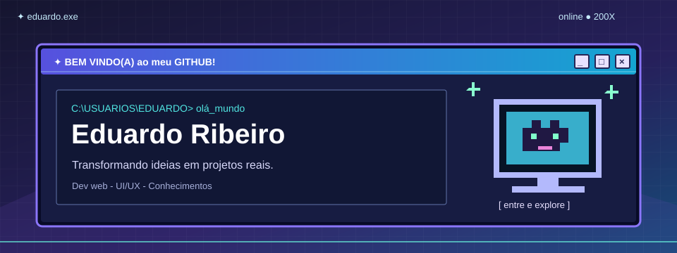
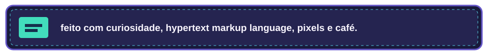

<div align="center">



**[ projetos ]** · **[ ideias ]** · **[ um pouquinho de caos organizado ]**

</div>

### `C:\USUARIOS\EDUARDO\SOBRE_MIM.TXT`

Olá, Mundo! Me chamo **Eduardo** 👋

Sempre buscando transformar ideias em algo real! E por aqui você encontra um pouco dessa dedicação, através de projetos de faculdade, testes, experimentos de produtos e interfaces construidas com dedicação e força de vontade.

```txt
STATUS       : explorando, aprendendo e construindo
INTERESSES   : desenvolvimento web • produto • interfaces
MODO ATUAL   : protótipos → código → ajustes → repetição
```

### `📂 projetos_em_destaque/`

| Janela                                                                    | O que tem dentro                                                       |
| :------------------------------------------------------------------------ | :--------------------------------------------------------------------- |
| [📚 Estúdio de Ideias](https://github.com/eduardomrb05/estudio-de-ideias) | Um repositório digital para organizar e descobrir projetos acadêmicos. |
| 🎮 **teamUP** · _em desenvolvimento_                                      | Uma experiência para encontrar duos e amizades para jogar.             |

### `🧰 caixa_de_ferramentas/`

`HTML` · `CSS` · `JavaScript` · `TypeScript` · `C#` · `NodeJs` · `Bootstrap` · `Angular` · `Git` · `GitHub` ·

<details>
<summary>📼 Clique para abrir o arquivo secreto</summary>
<br>

> A web dos anos 2000 tinha um talento especial para parecer um lugar feito por pessoas e esta página busca homenagear os pixels, às janelas coloridas e à vontade de experimentar.

E se você chegou até aqui: **visita registrada na agenda** 🤖

</details>

<br>

<div align="center">



<sub>Você está em <a href="https://github.com/eduardomrb05">github.com/eduardomrb05</a> · melhor visualizado com curiosidade</sub>

</div>
